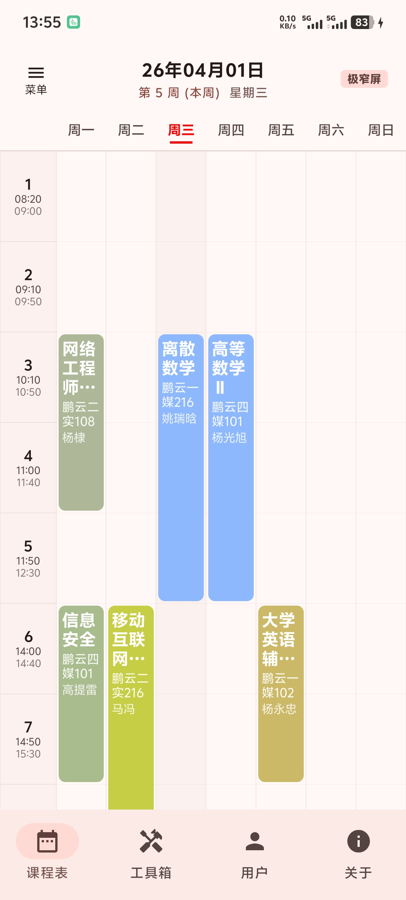

# 🎓 YNUFE

一个基于 Jetpack Compose 的安卓校园信息工具：支持教务系统登录同步课表/成绩、管理多账号，同时提供校园网 WLAN 账号管理与登录。

> 🧩 代码结构：`ui`（页面 + ViewModel）/ `data`（API + Repository + Room）/ `di`（Hilt 依赖注入）/ `utils`（解析与加密工具）

---

## ✨ 功能特性

- 🚀 启动页体验优化：控制 Splash 最短展示时间 + Room 首次就绪防闪屏
- 🔔 启动时检查版本更新（基于 Releases 的 APK 资源）
- 👤 教务账号管理：添加 / 编辑 / 切换 / 删除（支持验证码登录）
- 🗓️ 课表同步与展示：
  - 支持“安宁校区 / 龙泉校区”课程时段切换
  - 支持学期开始日期设置，并按当前周过滤显示
- 📄 成绩同步与展示：
  - 顶部搜索课程名
  - 及格 / 不及格筛选
- 🌐 校园网 WLAN 账号管理：
  - 添加 / 编辑 / 删除多条 WLAN 账号
  - 设定“主要账号”（`isActive`）
  - 账号登录 / 注销、查看登录日志
- 🔒 密码保护：
  - 教务密码使用 `CryptoManager` 加密存储（Room）
  - WLAN 密码使用 `CryptoManager` 加密存储（Room），登录前解密

---

## 🖼️ 页面预览

你可以把截图放到仓库 `docs/` 目录（或你喜欢的目录），并替换下面路径：

- 📅 课程表页：`docs/course.png`
- 🧾 成绩页：`docs/grade.png`
- 🧰 工具页：`docs/tool.png`
- 👤 用户页（教务账号 + 验证码）：`docs/user.png`
- 🌐 WLAN 页面（校园网账号管理）：`docs/wlan.png`
- ℹ️ 关于页（反馈 / 检查更新 / 仓库链接）：`docs/info.png`

示例：

```md

```

---

## 🧰 技术栈

- 🟦 Kotlin
- 🎨 Jetpack Compose + Material3
- 🧩 Hilt（依赖注入）
- 🌐 Retrofit + OkHttp（网络）
- 🗄️ Room（本地持久化）
- 🍃 Jsoup（HTML 解析）
- 🔁 Coroutines + Flow（状态驱动 UI）
- 🖼️ Coil（验证码图片加载）

---

## 🗺️ 架构概览

- `ui/`
  - 页面：`CourseScreen` / `ToolScreen` / `GradeScreen` / `WlanScreen` / `UserScreen` / `InfoScreen`
  - 状态：`*ViewModel` 将 Repository / Room 数据映射为 UI 状态
- `data/`
  - `api/`：Retrofit 接口（教务系统、版本检查、WLAN）
  - `repository/`：登录会话、同步课表/成绩、HTML 解析入库协调
  - `room/`：Entity / Dao / Database
- `di/`：分别配置不同 Retrofit / OkHttp（教务 vs WLAN vs 版本检查）
- `utils/`：加密、checksum / xxtea、JSONP 解析、字符串清洗与周次逻辑等

---

## 🔁 核心流程（教务：验证码登录 -> 同步入库）

### 1️⃣ 登录准备

- `UserScreen` 点击“获取课表 / 获取成绩”
- `UserViewModel.startLoginFlow()` 拉取验证码图片
- 调用链：`UserRepository.prepareLogin()` -> `LoginSystem.prepareLogin()`
  - 先尝试第一套流程（包含 `initSession` + 验证码）
  - 失败后自动尝试第二套流程
  - 返回验证码 `ByteArray`

### 2️⃣ 提交登录与抓取信息

- 弹窗输入验证码后触发同步：
  - 课表：`UserViewModel.getCourse(...)`
  - 成绩：`UserViewModel.getGrade(...)`
- 公共流程：
  - 同步前删除旧数据（课程或成绩）
  - `LoginSystem.submitLogin(...)` 根据流程选择第一套 / 第二套表单构造
  - 登录成功判定依据重定向 URL（包含 `xsMain.jsp`）
  - 成功后抓取 `xsMain_new.jsp` 并解析用户信息写入 `user_info`

### 3️⃣ 解析课表/成绩并入库

- `CourseRepository`：
  - `AppApi.getCourseTable()` -> `ParseJsp.parseCourseTable()` -> 写入 `course`
- `GradeRepository`：
  - `AppApi.getGradeTable()` -> `ParseJsp.parseGradeTable()` -> 写入 `grade`

### 4️⃣ 登出清理会话

- `UserViewModel` 在同步逻辑 `finally` 中调用：
  - `UserRepository.logout()` -> 清空 CookieJar
- 避免跨账号会话串联。

---

## 🌐 校园网 WLAN（登录 / 注销与加密）

- 📡 网络请求：
  - `WlanApi` 对 `http://172.16.130.31/` 发起 `getToken / loginWlan / wlanUserInfo / logoutWlan`
  - Retrofit 使用 `JsonpConverterFactory` 把 JSONP 脱壳为 JSON 再反序列化
- 🧮 登录加密与签名（`WlanRepository.login(...)`）：
  - 获取 `challenge` 与 `onlineIp`
  - 密码解密后计算 `hmacMd5`
  - 生成 `info`：`{SRBX1}` + XXTEA + 自定义 Base64
  - 生成 `checksum`：按协议拼接后做 SHA1
- 🗂️ 状态同步：
  - 登录成功后再次请求 `wlanUserInfo`，将 `ip/在线人数/状态` 写回 Room
  - UI 通过 Flow 自动刷新卡片状态与日志展示

---

## 🧷 权限说明

- 🌍 必需权限：`android.permission.INTERNET`

---

## ⚠️ 注意事项

- 🍃 HTML 解析依赖教务页面结构（`Jsoup` 选择器），页面改版后需同步调整解析逻辑
- 📆 当前周过滤依赖周次字符串解析规则（`DateUtils.isCourseInCurrentWeek`）
- 📡 WLAN 登录依赖校园网环境与网关返回
- 🔒 密码已加密存储，但仍建议避免在不可信环境下操作账号

---

## 🏗️ 构建与运行

- 📱 `minSdk = 24`
- 🎯 `targetSdk = 36`
- 🧪 `compileSdk = 36`
- ☕ JDK 17

运行步骤：

1. 使用 Android Studio 打开项目
2. 等待 Gradle 同步完成
3. 连接真机或启动模拟器运行 `app` 模块

---

## 🤝 贡献指南

欢迎提交 Issue / PR：

- 🐞 Issue：尽量附上复现步骤与错误日志
- 🔧 PR：保持代码风格一致，并说明验证场景

---

## 📄 License

许可证见仓库根目录 `LICENSE` 文件。